# GCN Raspberry Pi Kafka Demo

This project is an educational, interactive demonstration of fault-tolerant [Apache Kafka](https://kafka.apache.org) data streaming technology as used in astronomy by NASA's [General Coordinates Network (GCN)](https://gcn.nasa.gov). It is made for exhibition the NASA booth at conferences and trade shows. It was first shown at the [243rd Meeting of the American Astronomical Society in New Orleans, LA, January 7-11, 2024](https://aas.org/meetings/aas243).

The General Coordinates Network (GCN) is a public collaboration platform run by NASA for the astronomy research community to share alerts and rapid communications about high-energy, multimessenger, and transient phenomena. Idistributes alerts between space- and ground-based observatories, physics experiments, and thousands of astronomers around the world.

One of GCN's core services is a public astronomy notification service built on a [Confluent Kafka](https://www.confluent.io/product/confluent-platform/) deployed in the cloud on [Amazon Web Services](https://aws.amazon.com). In this demonstration, the **Kafka cluster** consists of three **brokers** running on [Raspberry Pi](https://www.raspberrypi.com) single-board computers, configured in a manner that is similar to the production GCN cluster. Three more Raspberry Pis are configured as Kafka **clients**; each client **produces** alerts on one **topic** and **consumes** alerts on the two other topics.

The 3-broker Kafka cluster is running in a **fully replicated** configuration: each topic has three copies, one stored on each broker. The cluster **acknowledges** records produced by the clients if it is stored on at least **two in sync replicas**. Thus, in normal operation, the cluster is tolerant to outages of any one broker.

Each Raspberry Pi has an LCD display. On the brokers, the display shows a table that indicates which topics are in sync. On the clients, the displays show a scrolling record of messages produced and consumed.

The visitor can interact with this demonstration in two ways:

1. Toggle the on/off switches to cut the network connection to any combinations of brokers and clients.
2. Press any of the buttons next to the clients to produce a message on that client's topic. Press and hold to produce messages repeatedly.

# Construction

## CAD Models

CAD models are available online in Autodesk Fusion:

- [GCN Kafka Demo v3](https://a360.co/44joF9M): 3D assembly
- [Plywood Sheet 1](https://a360.co/3MExCV4), [Plywood Sheet 2](https://a360.co/4pGtwL2), [Acrylic Sheet](https://a360.co/4rJitBY): laser cutter patterns with kerf compensation
- [Assembly Instructions](https://a360.co/3YQ5X6n)]: Mechanical drawings for artwork design reference and order of assembly

## Bill of Materials

| Qty | Image | Item | Part |
| - | - | - | - |
|    | | **Electronic Components**
| 6  | 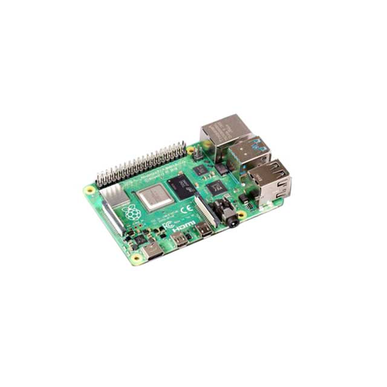 | Single Board Computer - Raspberry Pi 4B 8 GB | DigiKey [2648-SC0195(9)-ND](https://www.digikey.com/en/products/detail/raspberry-pi/SC0195-9/12159401) |
| 6  | 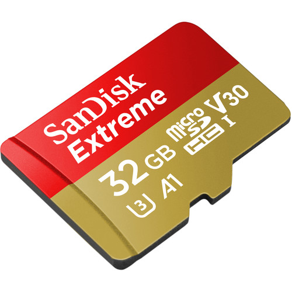 | SanDisk 32GB Extreme UHS-I microSDHC Memory Card | B&H Photo [SAEMSD32A1G3](https://www.bhphotovideo.com/c/product/1455053-REG/sandisk_32gb_extreme_uhs_i_microsdhc.html) |
| 6  | 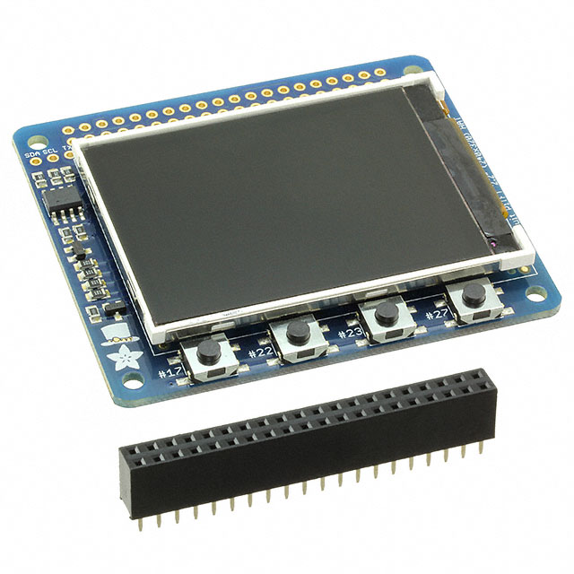 | LCD Display - Adafruit Mini PiTFT 1.3" | DigiKey [1528-1371-ND](https://www.digikey.com/en/products/detail/adafruit-industries-llc/2315/5629419) |
| 24 | 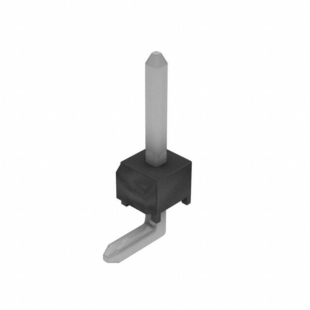 |  Right-Angle Thru-Hole 0.1" Pitch Pin Header | DigiKey [SAM1051-01-ND](https://www.digikey.com/en/products/detail/samtec-inc/TSW-101-08-T-S-RA/1102423) |
| 1  | 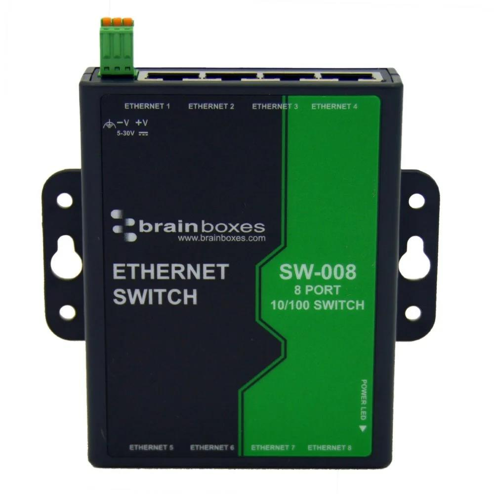 | 8-Port Ethernet Switch - Brainboxes SW-008 | DigiKey [2265-SW-008-ND](https://www.digikey.com/en/products/detail/brainboxes/SW-008/21574710) |
| 1  | 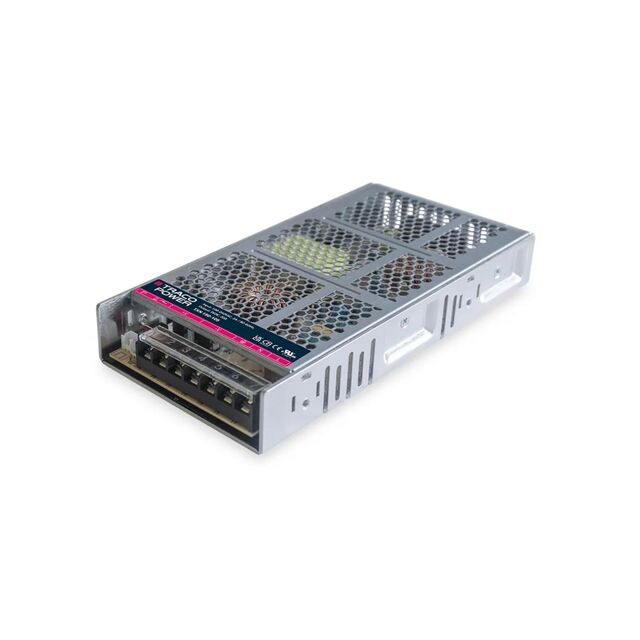 | AC/DC Convert 5V 150W - Traco Power TXN 150-105 | DigiKey [1951-TXN150-105-ND](https://www.digikey.com/en/products/detail/traco-power/TXN-150-105/26284179) |
| 1  | 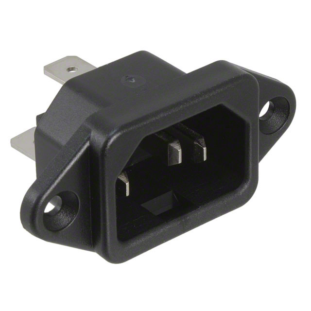 | IEC 60320 C14 Power Entry Module | DigiKey [486-1649-ND](https://www.digikey.com/en/products/detail/schurter-inc/6162-0159/2646985) |
| 1  | 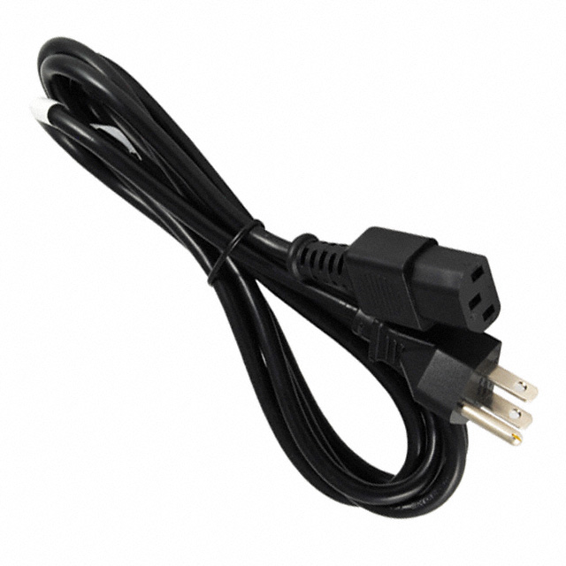 | IEC 60320 C13 Power Cable | DigiKey [839-11-00015-ND](https://www.digikey.com/en/products/detail/tensility-international-corp/11-00015/3900572) |
| 6  |  | DPST On/Off Rocker Switch | DigiKey [EG5600-ND](https://www.digikey.com/en/products/detail/e-switch/R5ABLKREDIF0/1805312) |
| 1  | 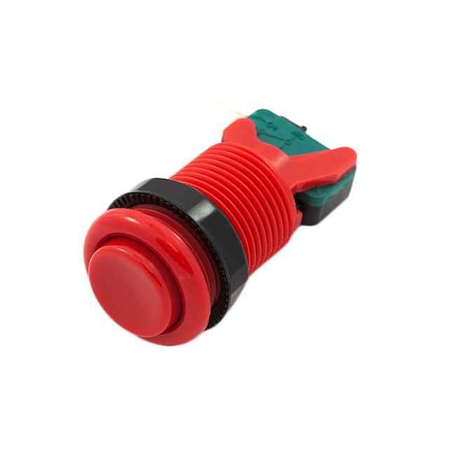 | Arcade Style SPDT Momentary Pushbutton - Red | DigiKey [1568-1476-ND](https://www.digikey.com/en/products/detail/sparkfun-electronics/COM-09336/6047815) |
| 1  | 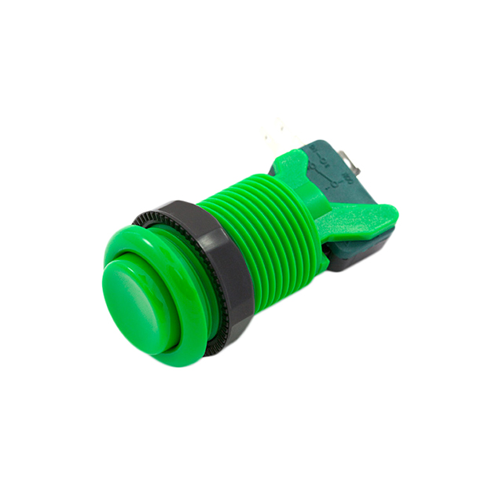 | Arcade Style SPDT Momentary Pushbutton - Green | DigiKey [1568-1481-ND](https://www.digikey.com/en/products/detail/sparkfun-electronics/COM-09341/6047820) |
| 1  |  | Arcade Style SPDT Momentary Pushbutton - Blue | DigiKey [1568-1477-ND](https://www.digikey.com/en/products/detail/sparkfun-electronics/COM-09337/6047816) |
| 12 | 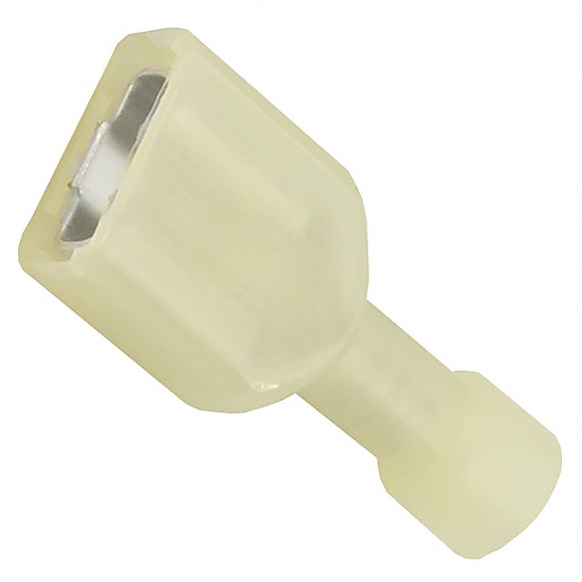 | Insulated Female Quick Connector 24-26 AWG | DigiKey [WM18235-ND](https://www.digikey.com/en/products/detail/molex/0190030071/279036) |
| 1  | 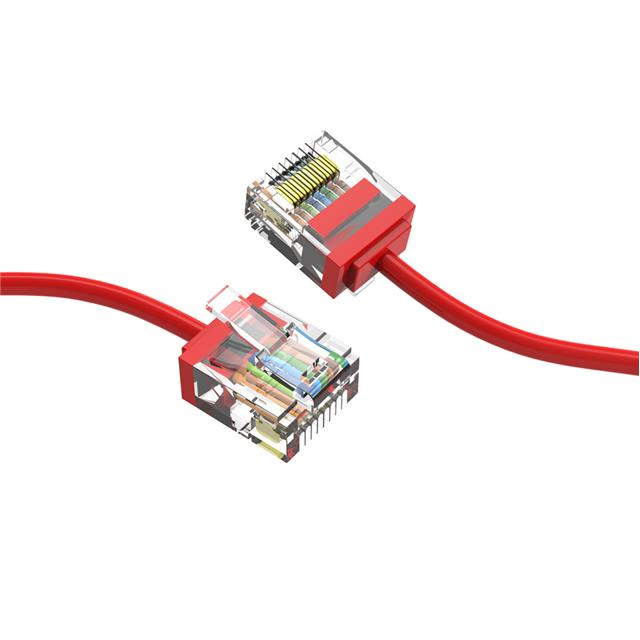 | 1.5' Super-Slim Ethernet Cable, Red | DigiKey [2671-CM-100291RDBSTK-ND](https://www.digikey.com/en/products/detail/coolgear/CM-100291RDBSTK/16751909) |
| 1  | 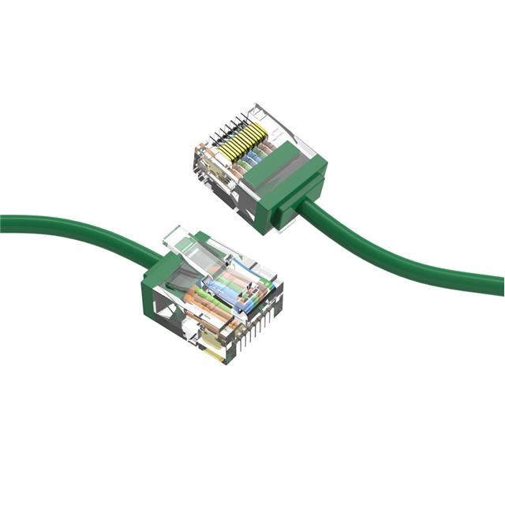 | 1.5' Super-Slim Ethernet Cable, Green | DigiKey [2671-CM-100291GNBSTK-ND](https://www.digikey.com/en/products/detail/coolgear/CM-100291GNBSTK/16752428) |
| 1  | 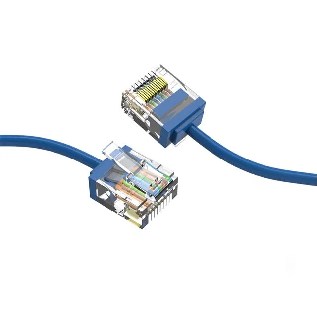 | 1.5' Super-Slim Ethernet Cable, Blue | DigiKey [2671-CM-100291BLBSTK-ND](https://www.digikey.com/en/products/detail/coolgear/CM-100291BLBSTK/16751644) |
| 3  | 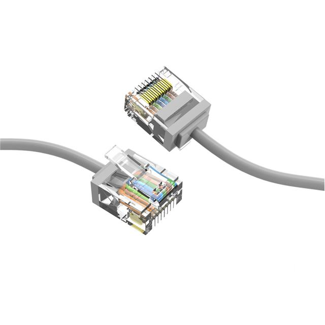 | 1.5' Super-Slim Ethernet Cable, Gray | DigiKey [2671-CM-100291GYBSTK-ND](https://www.digikey.com/en/products/detail/coolgear/CM-100291GYBSTK/16751641) |
| 50' |  | 2-Conductor Red/Black 22AWG Insulated Wire | DigiKey [839-30-00417-DS-ND](https://www.digikey.com/en/products/detail/tensility-international-corp/30-00417/24671209) |
| 50' | 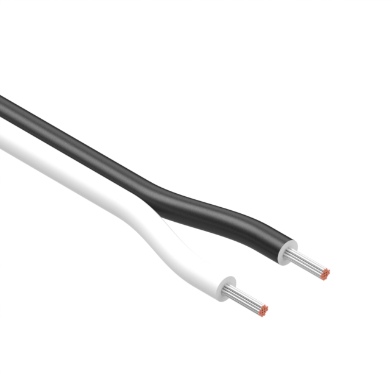 | 2-Conductor White/Black 22AWG Insulated Wire | DigiKey [839-30-03176-DS-ND](https://www.digikey.com/en/products/detail/tensility-international-corp/30-03176/21769218) |
| 10' | 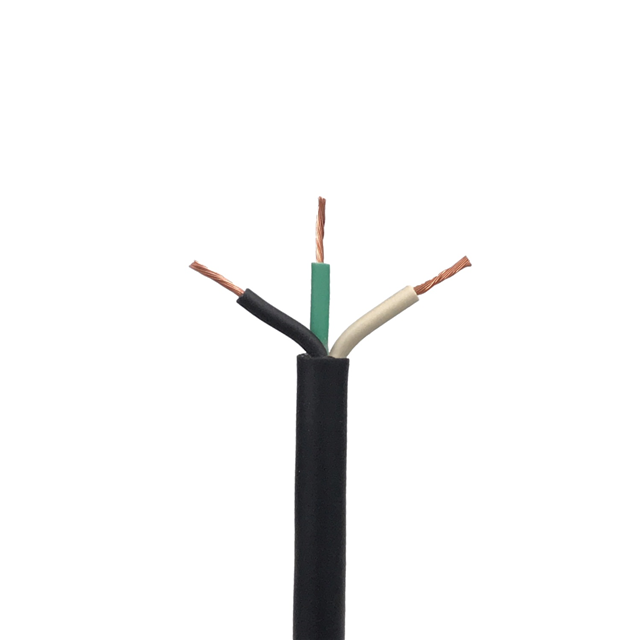 | 3-Conductor White/Black/Green 18AWG Insulated Wire | DigiKey [2328-SOOW1803-10-ND](https://www.digikey.com/en/products/detail/remington-industries/SOOW1803-10/14318126) |
| 50' | 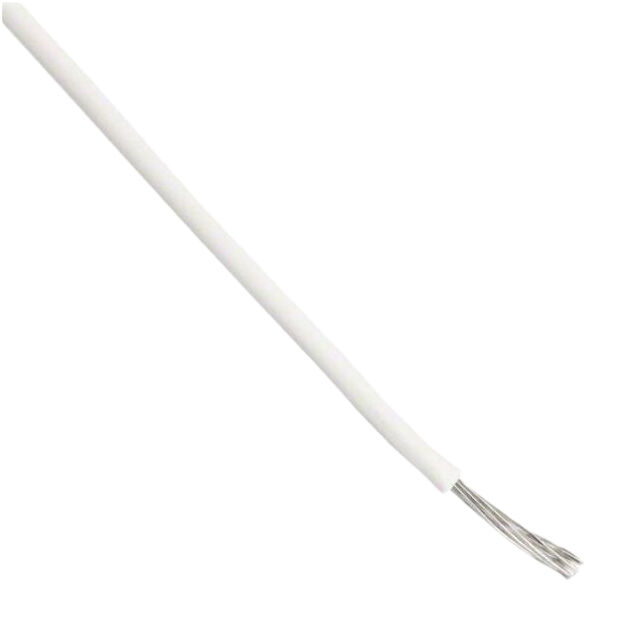 | 1-Conductor 24AWG Insulated Wire | DigiKey [1332-24-1-0500-002-1-S](https://www.digikey.com/en/products/detail/cnc-tech/1332-24-1-0500-002-1-S/26737551) |
| 1  | 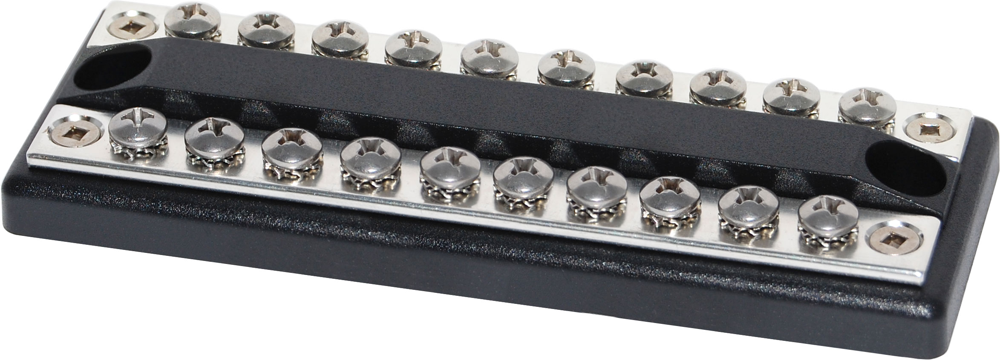 | Bus bar terminal block - Blue Sea Systems DualBus 100A BusBar - 10 Circuit | Manufacturer [product page](https://www.bluesea.com/products/2702/DualBus_100A_BusBar_-_10_Circuit) |
|    | | **Fasteners - Steel**
| 24 | | M2.5 12mm pan head Phillips screw - steel |
| 24 | | M2.5 lock washer - steel |
| 2  | | M3 14mm countersunk Phillips screw - steel |
| 4  | | M3 16mm pan head Phillips screw - steel |
| 6  | | M3 hex nut - steel |
| 6  | | M3 lock washer - steel |
| 4  | | M4 12mm pan head Phillips screw - steel |
| 4  | | M4 14mm pan head Phillips screw - steel |
| 4  | | M4 hex nut - steel |
| 4  | | M4 lock washer - steel |
| 2  | | #8-36 pan head Phillips screw - steel |
| 2  | | #8-36 hex nut - steel |
|    | | **Fasteners - Nylon**
| 12 | | M2.5 6mm pan head Phillips screw - nylon[^1] |
| 12 | | M2.5 hex nut - nylon[^1] |
| 12 | | M2.5 12mm female-female hex standoff - nylon[^1] |
| 36 | | M2.5 6mm male-female hex standoff - nylon[^1] |
|    | | **Machined Parts - 6mm Birch Plywood**
| 1  |  | Chassis Top | see CAD model |
| 1  |  | Chassis Bottom | see CAD model |
| 1  |  | Chassis Front | see CAD model |
| 1  |  | Chassis Back | see CAD model |
| 2  |  | Chassis Left/Right | see CAD model |
| 2  |  | Chassis Middle Support | see CAD model |
|    | | **Machined Parts - 3mm Clear Acrylic**
| 1  |  | Artwork Cover | see CAD model |
| 6  |  | Static Cover Top | see CAD model |
| 6  |  | Static Cover Left | see CAD model |
| 6  |  | Static Cover Right | see CAD model |
| 12  |  | Static Cover Front/Back | see CAD model |
|    | | **Miscellaneous**
| 1  | 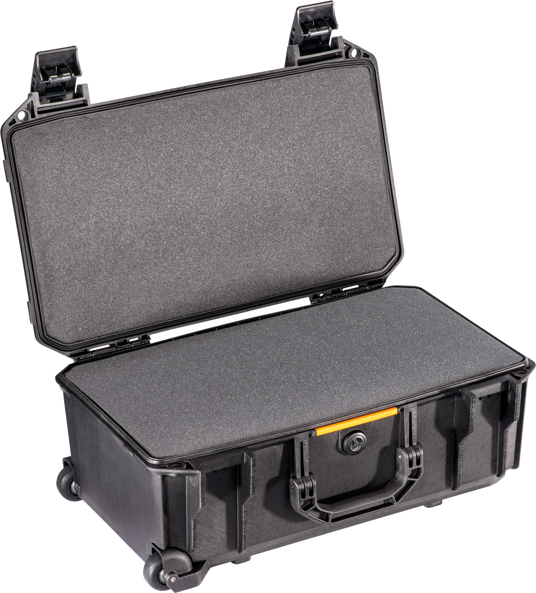 | Pelican V525 Vault Rolling Case | Manufacturer [product page](https://www.pelican.com/us/en/product/cases/rolling-case/vault/v525)
| 1  |  | Weld-On 3 Acrylic Plastic Cement with Applicator Bottle | Amazon [product page](https://a.co/d/g46TBD8) |
| 1  |  | All Purpose Flat Black Spray Paint | Home Depot [product page](https://www.homedepot.com/p/HDX-10-oz-All-Purpose-Flat-Black-Spray-Paint-AF79705UF) |
|    | | Wood glue |

[^1]: Rather than ordering these items individually, it is more cost-effective to purchase Qty. 2 [Black Nylon Machine Screw and Stand-off Set – M2.5 Thread](https://www.adafruit.com/product/3299) available from Adafruit.

# Setup

## To prepare the Raspberry Pis

Follow these instructions for _N_ = 1 to 6 to prepare each of the 6 Raspberry Pis. On your workstation, do the following:

1. Download, install, and launch the [Raspberry Pi Imager](https://www.raspberrypi.com/software/) application.

2. In the Raspberry Pi Imager application, on the `Device` page, select `Raspberry Pi 4` and click `Next`.

3. On the `OS` page, select `Raspberry Pi OS (64-bit)` and click `Next`.

4. In the `Customization` section...

    a. On the `Hostname` page, enter <code>gcndemo<i>N</i></code> where _N_ is an integer.

    b. On the `Localization` page, enter your city, time zone, and keyboard layout.

    c. On the `User` page, set the username to `gcndemo`; choose (and save in a secure location) a random password.

    d. On the `Wi-Fi` page, configure the WiFi network that you will use while installing software on the Raspberry Pis. You can optionally skip this step and later connect a keybaord and monitor to the Raspberry Pi temporarily to set the WiFi network on the desktop.

    e. On the `Remote access` page, make sure that `Enable SSH` and `Use public key authentication` are selected, and enter your SSH public key.

    f. On the `Raspberry Pi Connect` page, make sure that `Enable Raspberry Pi Connect` is turned off.

5. Click `Write`.

6. After Raspberry Pi Imager has finished writing, remove and re-insert the microSD card. It should appear on your desktop as a disk called `bootfs`. Inside this disk, edit the file called `cmdline.txt`. Add the following code to the beginning of the first line of that file: <code>ip=10.0.42.<i>N</i>::255.255.255.0::eth0</code>, where _N_ is the number of the device.

7. Unmount and remove the microSD card from your computer.

8. Insert the microSD card into the Raspberry Pi.

## Configure SSH connection with workstation

The following instructions apply only to **Mac OS**:

1. Go to Settings --> Network --> WIFI
2. Click <code>Belkin USB-C LAN</code> (this option will only appear if valid wired connection between workstation and ethernet switch)
3. Click <code>Details</code> and go to <code>TCP/IP</code> tab
4. Change <code>Configure IPv4</code> option to <code>Manually</code>
5. Change <code>IP Address</code> to <code>10.0.42.<i>N</i></code>, where N is any integer NOT between 1-6 (including bounds)
6. Change <code>Subnet Mask</code> to same subnet mask as the Raspberry Pis: <code>255.255.255.0</code>
7. Click <code>OK</code> to save

Complete the following steps for each individual Pi

8. Boot the Pi
9. Connect individually with SSH command to the Pi with respective IP Address
10. Accept warning message about unknown SSH fingerprint (only applicable on first attempt)
11. Repeat for all Pis

## To configure our demo software on the Raspberry Pis

We use [Ansible](https://docs.ansible.com) to automate the rest of the setup of the Raspberry Pis.

1. Connect all 6 of the Raspberry Pis _and_ your workstation to a single Ethernet switch. Boot all of the Raspberry Pis.

2. Clone this repository onto your workstation by running the command:

        git clone https://github.com/nasa-gcn/gcn-raspberry-pi-demo

3. Change to the `ansible` directory in the repository:

        cd gcn-raspberry-pi-demo/ansible

4. Install Ansible on your workstation by running the command:

        pip install ansible

5. Run the Ansible playbook:

        ansible-playbook main.yml

   This will cause the Raspberry Pis to reboot once or more.

6. (Optional, recommended) Set the Raspberry Pis to mount the microSD card as read-only and overlay a temporary filesystem over top. This will decrease wear on the microSD cards and make it safe to cut the power without first shutting down the Raspberry Pis.

        ansible-playbook overlayfs_enable.yml

# Operation

## Startup

1. Ensure that all rocker switches are in the "On" position.

2. Connect the power cable.

3. Wait until all of the Raspberry Pis have booted and started their display programs. It may take a few minutes before Kafka messages flow properly.

## Pinhole Troubleshooting Buttons

There are four small buttons on the PiTFT display hats, labeled `#17`, `#22`, `#23`, and `#27`, that have been mapped to troubleshooting functions for exhibit staff. To press them, reach through the pinholes in the clear acrylic display cases using a paperclip. The buttons are mapped to the following functions:

| Button | Function |
| - | - |
| `#17` | Shut down the Raspberry Pi |
| `#22` | Reboot the Raspberry Pi |
| `#23` | Restart the display program |

Note that some of the Raspberry Pis are rotated 180° relative to the others, so make sure to pay attention to the button labels and not their positions.

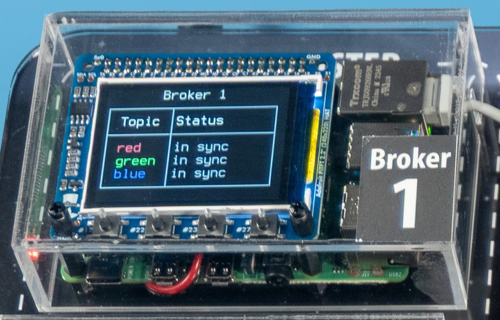
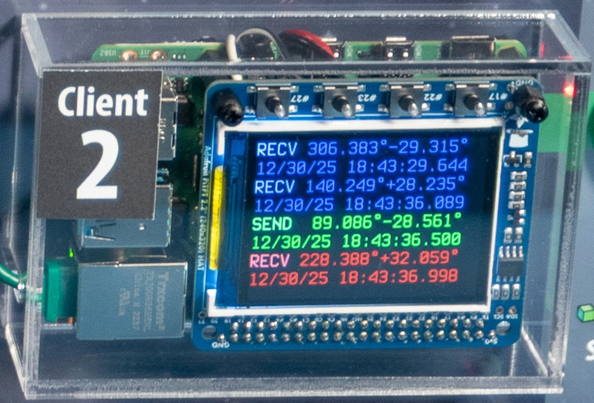

## Shutdown

1. Make sure that all of the rocker switches are in the "On" position.

2. For each Raspberry Pi, press the  `#17` pinhole button.

3. What until the link lights on all of the Raspberry Pi's Ethernet ports, and on the Ethernet switch, go dark.

4. Unplug the power cable.

If you have configured the microSD cards to be read-only (see [To configure our demo software on the Raspberry Pis](#to-configure-our-demo-software-on-the-raspberry-pis)), then you can safely skip steps 1-3.

## Troubleshooting

### How do I see diagnostic messages from the Kafka client programs?

The Kafka client prints many useful diagnostic messages when it obtains or loses connections to brokers. These messages are useful for tuning performance and fault tolerance. You can view these messages live by following these steps:

1. Connect your workstation to the Ethernet switch.

2. Start an SSH session on the Raspberry Pi that you want to watch by running this command:

    <pre>ssh gcndemo@10.0.42.<i>N</i></pre>

3. In the SSH session, run the following command:

       journalctl -f -u gcndemo.service

   (Note that if you cut off that Raspberry Pi's network connection, then the
   live display will stop, but it should resume and fill in everything that you
   have missed as soon as you restore the connection.)
