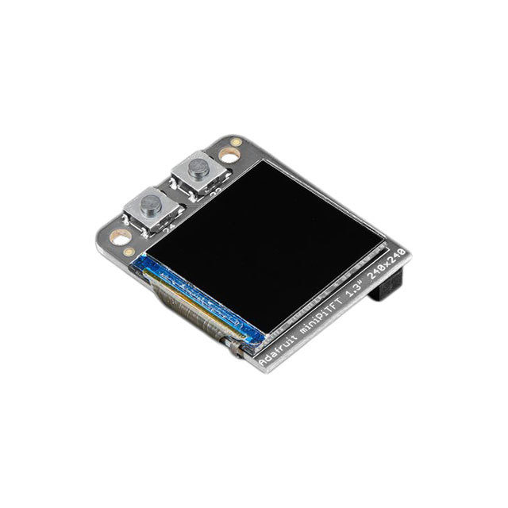
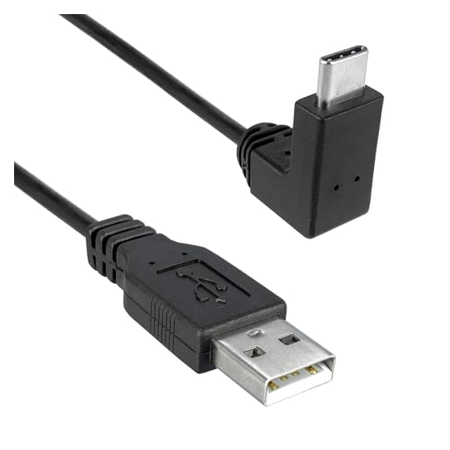
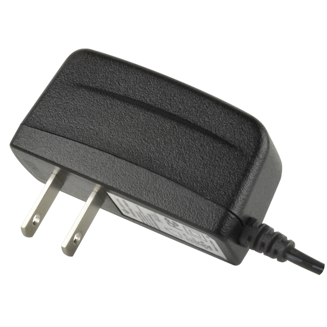
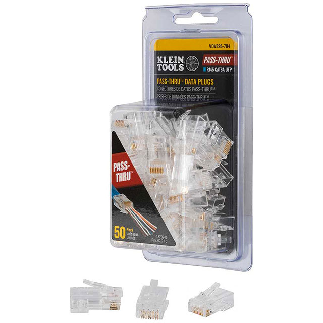
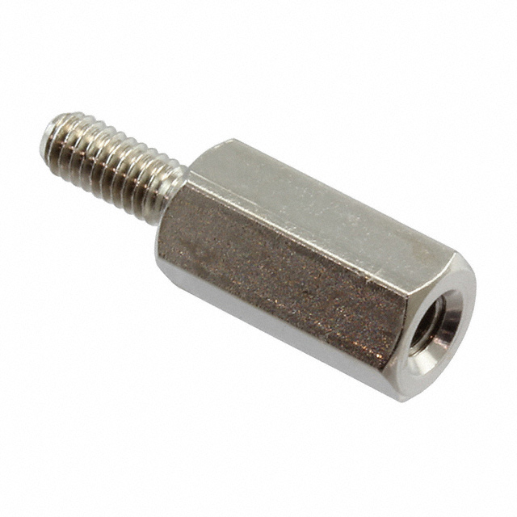
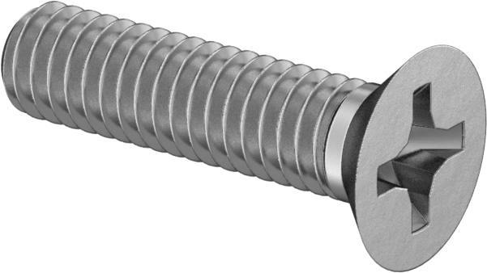

# GCN Raspberry Pi Kafka Demo

This project is an educational, interactive demonstration of fault-tolerant [Apache Kafka](https://kafka.apache.org) data streaming technology as used in astronomy by NASA's [General Coordinates Network (GCN)](https://gcn.nasa.gov). It is made for exhibition the NASA booth at conferences and trade shows. It was first shown at the [243rd Meeting of the American Astronomical Society in New Orleans, LA, January 7-11, 2024](https://aas.org/meetings/aas243).

The General Coordinates Network (GCN) is a public collaboration platform run by NASA for the astronomy research community to share alerts and rapid communications about high-energy, multimessenger, and transient phenomena. Idistributes alerts between space- and ground-based observatories, physics experiments, and thousands of astronomers around the world.

One of GCN's core services is a public astronomy notification service built on a [Confluent Kafka](https://www.confluent.io/product/confluent-platform/) deployed in the cloud on [Amazon Web Services](https://aws.amazon.com). In this demonstration, the **Kafka cluster** consists of three **brokers** running on [Raspberry Pi](https://www.raspberrypi.com) single-board computers, configured in a manner that is similar to the production GCN cluster. Three more Raspberry Pis are configured as Kafka **clients**; each client **produces** alerts on one **topic** and **consumes** alerts on the two other topics.

The 3-broker Kafka cluster is running in a **fully replicated** configuration: each topic has three copies, one stored on each broker. The cluster **acknowledges** records produced by the clients if it is stored on at least **two in sync replicas**. Thus, in normal operation, the cluster is tolerant to outages of any one broker.

Each Raspberry Pi has an LCD display. On the brokers, the display shows a table that indicates which topics are in sync. On the clients, the displays show a scrolling record of messages produced and consumed.

The visitor can interact with this demonstration in two ways:

1. Toggle the on/off switches to cut the network connection to any combinations of brokers and clients.
2. Press any of the buttons next to the clients to produce a message on that client's topic. Press and hold to produce messages repeatedly.

# Construction

## Bill of Materials

| Qty | Image | Item | Part |
| - | - | - | - |
|    | | **Electronic Components**
| 6  |  | Single Board Computer - Raspberry Pi 4B 8 GB | DigiKey [2648-SC0195(9)-ND](https://www.digikey.com/en/products/detail/raspberry-pi/SC0195-9/12159401) |
| 6  |  | LCD Display - Adafruit Mini PiTFT 1.3"/> | DigiKey [1528-4484-ND](https://www.digikey.com/en/products/detail/adafruit-industries-llc/4484/11503310) |
| 1  |  | 8-Port Ethernet Switch - Brainboxes SW-008 | DigiKey [2265-SW-008-ND](https://www.digikey.com/en/products/detail/brainboxes/SW-008/21574710) |
| 6  |  | DPST On/Off Rocker Switch | DigiKey [EG5600-ND](https://www.digikey.com/en/products/detail/e-switch/R5ABLKREDIF0/1805312) |
| 1  |  | Arcade Style SPDT Momentary Pushbutton - Red | DigiKey [1568-1476-ND](https://www.digikey.com/en/products/detail/sparkfun-electronics/COM-09336/6047815) |
| 1  |  | Arcade Style SPDT Momentary Pushbutton - Green | DigiKey [1568-1481-ND](https://www.digikey.com/en/products/detail/sparkfun-electronics/COM-09341/6047820) |
| 1  |  | Arcade Style SPDT Momentary Pushbutton - Blue | DigiKey [1568-1477-ND](https://www.digikey.com/en/products/detail/sparkfun-electronics/COM-09337/6047816) |
| 6  |  | USB-A Male to USB-C Male Right Angle Cable | DigiKey [189-3021108-01M-ND](https://www.digikey.com/en/products/detail/qualtek/3021108-01M/13181646) |
| 1  |  | DC 5V 5W Power Adapter | DigiKey [102-4120-ND](https://www.digikey.com/en/products/detail/cui-inc/SWI5-5-N-P5/6579910) |
| 18 |  | Insulated Female Quick Connector 24-26 AWG | DigiKey [WM18235-ND](https://www.digikey.com/en/products/detail/molex/0190030071/279036) |
| 12 |  | RJ45 8P8C Ethernet Plug | DigiKey [1742-VDV826-704-ND](https://www.digikey.com/en/products/detail/klein-tools-inc/VDV826-704/14636893) |
| 1  | | 6-port USB-A power hub, 5V 2.5A DC per output | No part number available; we have some nondescript device by a manufacturer called Lottogo. **FIXME**: find a similar part that is available through DigiKey. |
| -  | | Spool of Cat5 cable | |
| -  | | 24 AWG Insulated Wire | |
| -  | | Female Breadboard Pin Headers | |
|    | | **Spacers**
| 24 |  | Brass Spacer M2.5 x 6mm+6mm\* | DigiKey [732-12901-ND](https://www.digikey.com/en/products/detail/würth-elektronik/971060154/9488605) |
| 6  |  | Brass Spacer M2.5 x 10mm+6mm\* | DigiKey [732-12917-ND](https://www.digikey.com/en/products/detail/würth-elektronik/971100154/9488621) |
| 18 |  | Brass Spacer M2.5 x 20mm+6mm\* | DigiKey [732-12949-ND](https://www.digikey.com/en/products/detail/würth-elektronik/971200154/9488653) |
|    | | **Fasteners**
| 24 |  | M2.5 Hex Nut\* | McMaster [91828A113](https://www.mcmaster.com/catalog/91828A113) |
| 4  |  | M2.5 x 10mm Phillips Flat Head Bolt | McMaster [92010A020](https://www.mcmaster.com/catalog/92010A020) |
| 6  |  | M2.5 x 6mm Phillips Pan Head Bolt | McMaster [92000A104](https://www.mcmaster.com/catalog/92000A104) |
| 18 |  | M2.5 x 8mm Phillips Pan Head Bolt | McMaster [92000A105](https://www.mcmaster.com/catalog/92000A105) |
| 4  |  | M3.5 x 10mm Phillips Pan Head Bolt | McMaster [92000A155](https://www.mcmaster.com/catalog/92000A155) |
| 4  |  | M3.5 Hex Nut | McMaster [91828A220](https://www.mcmaster.com/catalog/91828A220) |
| 24 |  | M2.5 Lock Washer | McMaster [92148A070](https://www.mcmaster.com/catalog/92148A070) | |
|    | | **Machined Parts**
| 1  |  | Aluminum Project Board | Fusion 360 [CAD model](https://a360.co/41hcmYX) |
| 4  |  | Aluminum Project Board Foot | Fusion 360 [CAD model](https://a360.co/48mfR2I) |
| 6  |  | Transparent Acrylic Raspberry Pi Cover | Fusion 360 [CAD model](https://a360.co/3GTA6J0) |
|    | | **Miscellaneous**
| 1  |  | Pelican V525 Vault Rolling Case | Manufacturer [product page](https://www.pelican.com/us/en/product/cases/rolling-case/vault/v525)

\* Rather than ordering these items individually, it is more cost-effective to purchase Qty. 3 [M2.5 Spacer Kit](https://www.amazon.com/dp/B01L06CUJG) available from Amazon.

## Assembly Notes

### Power Supply for SW-008 Ethernet Switch

The Brainboxes SW-008 Ethernet switch has a terminal block plug. To connect the DC 5V 5W power adapter to the Ethernet switch:

1. Snip off the adapter's barrel connector. Separate a few centimeters of the wire and strip a few mm of insulation.
2. Identify the ground and +5V wires of the power adapter using a multimeter.
3. Consult the wiring diagram on the [data sheet for the SW-008](https://www.brainboxes.com/files/catalog/product/SW/SW-008/documents/SW-008-datasheet.pdf). Note that the power adapter has two conductors but the SW-008 terminal block has three conductors. Insert the power adapter's ground wire into the terminal block's -V receptacle and the +5V wire into the +V receptacle. Connect the terminal block's -V and Functional Earth receptacles with a jumper wire.

# Setup

## To prepare the Raspberry Pis

Follow these instructions for _N_ = 1 to 6 to prepare each of the 6 Raspberry Pis. On your workstation, do the following:

1. Download, install, and launch the [Raspberry Pi Imager](https://www.raspberrypi.com/software/) application.

2. Mount a MicroSD card.

3. In the Raspberry Pi Imager application, select the OS `Raspberry Pi OS (64-bit)`.

4. Click the gear icon to select advanced options.

    a. Set hostname to <code>gcndemo<i>N</i></code> where _N_ is an integer.

    b. Check `Enable SSH`. Check `Allow public-key authentication only` and select your authorized keys.

    c. Check `Set username and password`. Set the username to `gcndemo`; choose (and save in a secure location) a random password.

    d. Check `Set locale settings` and select your time zone and keyboard layout.

    e. Click `Save`.

5. Click `Write`.

6. Remove the MicroSD card from your computer

Then, on the Raspberry Pi:

1. Insert the MicroSD card into the Raspberry Pi. Connect a monitor, keyboard, and mouse, and boot it.

2. Open a terminal and make the following changes:

    a. Write the following to /etc/network/interfaces.d/eth0:

    <pre>
    auto eth0
    allow-hotplug eth0
    iface eth0 inet static
        address 10.0.42.<i>N</i>/16</pre>

    b. Write the following to /etc/ssh/sshd_config.d/linklocal.conf:

    <pre>ListenAddress 10.0.42.<i>N</i></pre>

    c. Run the following:

        sudo apt-get update
        sudo apt-get update

5. Reboot the Raspberry Pi.

Make sure that you can ssh to the Raspberry Pi. Then unplug the monitor, keyboard, and mouse. Then proceed to set up the next Raspberry Pi.

## To configure our demo software on the Raspberry Pis

We use [Ansible](https://docs.ansible.com) to automate the rest of the setup of the Raspberry Pis.

1. Connect all 6 of the Raspberry Pis _and_ your workstation to a single Ethernet switch. Boot all of the Raspberry Pis.

2. Install Ansible on your workstation by running the command:

        pip install ansible

3. Run each of our playbooks in the following order:

        ansible-playbook -i inventory.yml playbooks/proxy.yml
        ansible-playbook -i inventory.yml playbooks/pitft.yml
        ansible-playbook -i inventory.yml playbooks/reboot.yml
        ansible-playbook -i inventory.yml playbooks/setup.yml
        ansible-playbook -i inventory.yml playbooks/clients.yml
        ansible-playbook -i inventory.yml playbooks/pitft_buttons.yml

# Operation

## Startup

1. Ensure that all rocker switches are in the "On" position.

2. Connect the power cable for the Ethernet switch to a wall outlet.

3. Connect the power cable for the USB hub to a wall outlet.

## Shutdown

1. For each Raspberry Pi, carefully reach under its transparent acrylic cover with an insulating object and press and hold for five seconds the _uppermost_ of the two buttons on the Mini PiTFT.

2. Wait about 30 seconds, or until all of the green ACT lights on the Raspberry Pis are off _and_ the EThernet link lights are all off.

## Troubleshooting

### The interactive display has frozen.

When Raspberry Pi OS is shut down and power is still suplied to the Raspberry Pi, the Mini PiTFT display will show the last image that was sent to it. If the green ACT light in the corner of the Raspberry Pi is off _and_ the link lights on the Raspberry Pi's Ethernet port are off, then Raspebrry Pi OS is halted. If this is the case, then unplug and re-plug the power to the Raspberry Pi to restart it.

If Raspberry Pi is on and the display is frozen, then you can restart the program that drives the dispaly. To do this, carefully reach under the Raspberry Pi's cover with an insulating object and press the _uppermost_ of the two buttons on the Mini PiTFT to restart the display program.

### One or more Kafka brokers are never in sync.

Sometimes the Kafka broker fails to start when the system boots up. To forcibly restart the Kafka broker, carefully reach under the Raspberry Pi's cover with an insulating object and press the _lowermost_ of the two buttons on the Mini PiTFT to restart the display program.

### How do I see diagnostic messages from the Kafka client programs?

The Kafka client prints many useful diagnostic messages when it obtains or loses connections to brokers. These messages are useful for tuning performance and fault tolerance. You can view these messages live by following these steps:

1. Connect your workstation to the Ethernet switch.

2. Start an SSH session on the Raspberry Pi that you want to watch by running this command:

    <pre>ssh gcndemo@10.0.42.<i>N</i></pre>

3. In the SSH session, run the following command:

       journalctl -f -u gcndemo.service

   (Note that if you cut off that Raspberry Pi's network connection, then the
   live display will stop, but it should resume and fill in everything that you
   have missed as soon as you restore the connection.)
